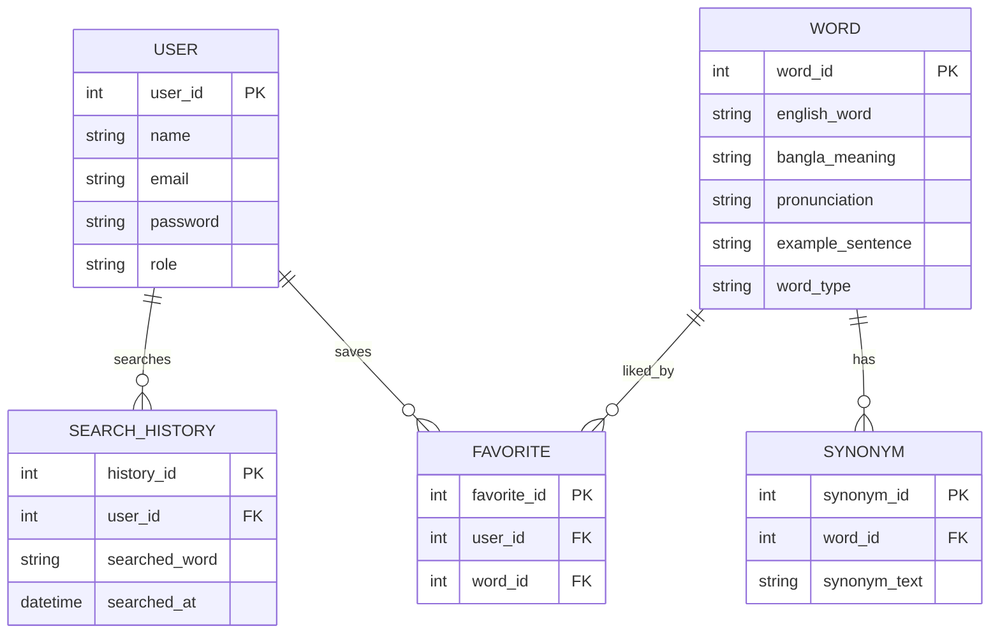

Here is a **clean “slot” section for your ER Diagram** that you can directly paste into your README.

---

# 📊 Entity Relationship Diagram (ER Diagram)

The ER Diagram represents the database structure of the **English Janala – Smart English Learning Dictionary** system. It shows the relationships between users, words, favorites, synonyms, and search history.

---

## 🧩 Main Entities

### User

* user_id (PK)
* name
* email
* password
* role (admin/user)

---

### Word

* word_id (PK)
* english_word
* bangla_meaning
* pronunciation
* example_sentence
* word_type

---

### Synonym

* synonym_id (PK)
* word_id (FK)
* synonym_text

---

### Favorite

* favorite_id (PK)
* user_id (FK)
* word_id (FK)

---

### SearchHistory

* history_id (PK)
* user_id (FK)
* searched_word
* searched_at

---

## 🔗 Relationships

* A **User** can have multiple **Favorites**
* A **User** can have multiple **Search History records**
* A **Word** can have multiple **Synonyms**
* A **Word** can be saved by multiple Users (via Favorites)

---

## 🧠 ER Diagram (Insert Here)

👉 Replace this section with your diagram image or Mermaid code.

### Option 1: Image

```html

```

---

### Option 2: Mermaid Code (Recommended for GitHub)



---

## 📌 Summary

This ER design ensures:

* Efficient word storage
* Fast search functionality
* User personalization (favorites & history)
* Scalable vocabulary management system

---

If you want, I can also:
✅ Convert this into a **PNG ER diagram image**
✅ Make a **UML Class Diagram**
✅ Or design a **system architecture diagram (MERN stack)**
